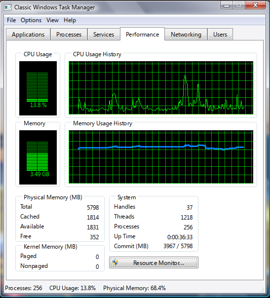
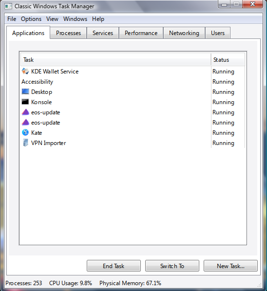
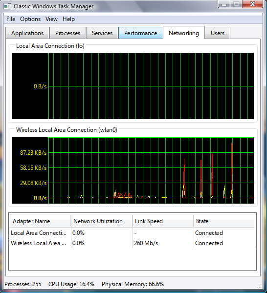
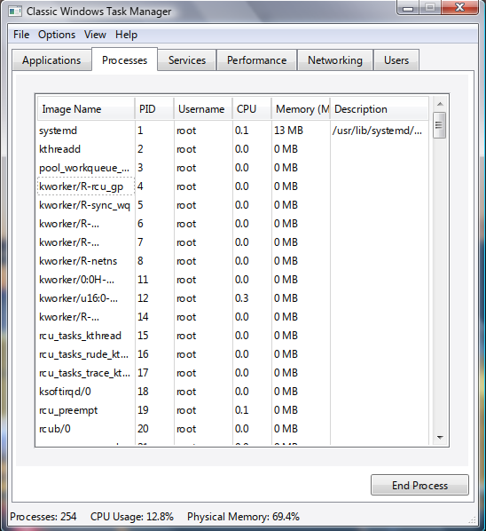
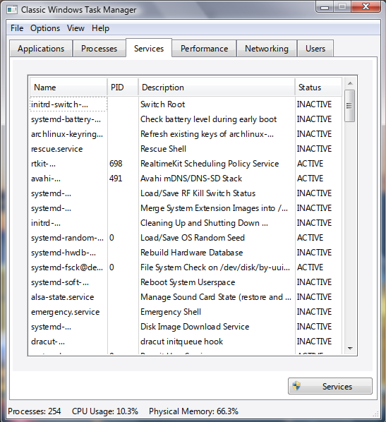

# Classic Windows Task Manager Linux

Recreates the familiar look and feel of Windows 7’s Task Manager on KDE 5/6, giving you quick access to Applications, Processes, Performance, Networking, Services, and Users in one unified interface. While it doesn’t implement every single feature of the original, it supports live PyQtGraph charts, D-Bus and AccountsService integration, and is fully themeable via Qt5 styles (qt5ct/Kvantum).

<a href="./screenshots/performance_tab.png">
    
</a>

## Requirements
### Insalling Dependencies on Ubuntu
Install the following packages
```
sudo apt update
sudo apt install \
  python3-pyqt5 \
  python3-pyqt5.qttools \
  python3-pyqtgraph \
  python3-psutil \
  python3-dbus \
  python3-gi \
  gir1.2-gtk-3.0 \
  gir1.2-accountsservice-1.0
  ```
  
### Installing Dependencies on Arch
```
sudo pacman -Sy
sudo pacman -S \
  python-pyqt5 \
  python-pyqtgraph \
  python-psutil \
  python-dbus \
  python-gobject
  qt5ct \
  kvantum-qt5
```

### Installing Dependencies with PiP
```
pip install --upgrade pip
pip install -r requirements.txt
```

## Running the Program
First, clone the repository, and then run the main file.
```bash
git clone https://github.com/JonDanB/classic-windows-task-manager-linux.git
cd classic-windows-task-manager-linux
python3 main.py
```

## Screenshots
<p align="center">
  <a href="./screenshots/applications_tab.png">
    
  </a>
  <a href="./screenshots/network_tab.png">
    
  </a>
  <a href="./screenshots/performance_tab.png">
    
  </a>
</p>

<p align="center">
  <a href="./screenshots/processes_tab.png">
    
  </a>
  <a href="./screenshots/services_tab.png">
    
  </a>
</p>

